# Lab 1 — Switches, Lights, and Multiplexers (FPGA DE10-Lite)

This repository documents my first FPGA lab using the DE10-Lite (MAX 10 10M50DAF484C7G).  
The goal is to learn how to connect simple input/output devices and implement multiplexers, decoders, and sequential logic. I will use the switches SW[9-0] as inputs to the circuit, light emitting diodes (LEDs) and 7-segment displays as output devices.

## Table of Contents
- [Part I — Switches to LEDs](## PART I)
- [Part II — 2-to-1 4-bit MUX](## PART I)
- [Part III — 4-to-1 2-bit MUX](#part-iii)
- [Part IV — 7-segment decoder (H, E, L, O)](#part-iv)
- [Part V — Static HELLO on 5 displays](#part-v)
- [Part VI — HELLO with blank space](#part-vi)
- [Part VII (Extra) — Automatic scrolling HELLO](#part-vii-extra)

  
## PART I — Switches to LEDs

### Objective
Implement and test a simple assignament of the switches to the LEDs.

### Logic / Design
A main block contains the expression to assign the nine switches to the corresponding LEDs.

*Figure 1.1 — Switches to LEDs assignament logic*

### Implementation

*Figure 1.2 — Switches to LEDs Implementation*

## PART II — 2-to-1 4-bit Multiplexer

### Objective
Implement and test a 2-to-1 multiplexer that handles 4-bit inputs using Verilog on the DE10-Lite FPGA.

### Logic / Design
A 2-to-1 4-bit multiplexer can be built by combining four instances of a 2-to-1 1-bit multiplexer.

*Figure 2.1 — 1-bit 2-to-1 multiplexer logic*

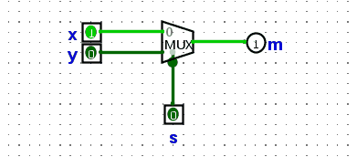

*Figure 2.2 — 4-bit 2-to-1 multiplexer block diagram*

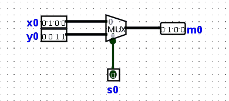

### Implementation

*Figure 2.3 — 1-bit 2-to-1 multiplexer Implementation*

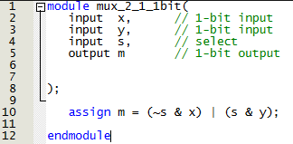

*Figure 2.4 — 4-bit 2-to-1 multiplexer Implementation*

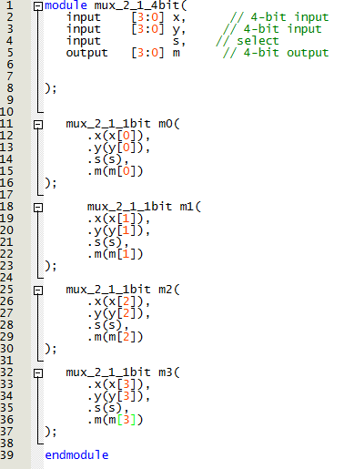

*Figure 2.5 — Main block Implementation*

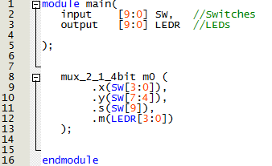

### Demonstration

*Figure 2.6 — 2-to-1 4-bit Multiplexer Demonstration*

## PART III — 4-to-1 2-bit Multiplexer

### Objective
Implement and test a 4-to-1 multiplexer that handles 2-bit inputs using Verilog on the DE10-Lite FPGA.

### Logic / Design
A 4-to-1 2-bit multiplexer can be built by combining two instances of a 4-to-1 1-bit multiplexer.

*Figure 3.1 — 2-bit 4-to-1 multiplexer logic*

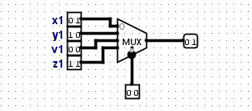

### Implementation

*Figure 3.2 — 1-bit 4-to-1 multiplexer Implementation*

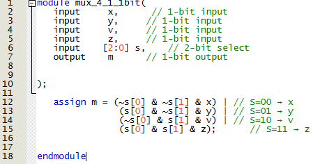

*Figure 3.3 — 2-bit 4-to-1 multiplexer Implementation*

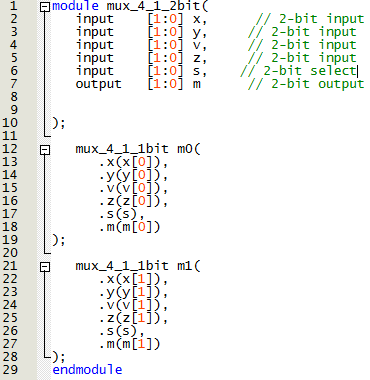

*Figure 3.4 — Main block Implementation*

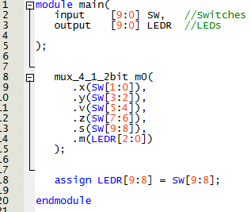

### Demonstration

*Figure 3.5 — 4-to-1 2-bit Multiplexer Demonstration*

## PART IV — 7-segments display decoder to dsiplay letters [H, E, L, O]

### Objective
Implement and test a module of a 7 segments decoder to display the letters "H", "E", "L" and "O".

### Logic / Design
A 7-segment decoder is used to display the characters or numbers desiared with a 3-bit input. In this implementation, are only needed 7 bits, the "dot" (8th bit is not needed). And to make the design simple, only four charactersare included in the table plus the 'Blank' character.

*Figure 4.1 — 7-segment decoder logic*

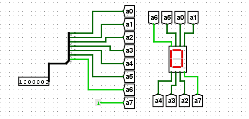

To define the logic, a Look Up Table (LUT) is needed. The 7 segment displays are NOT active in high, whenever are required to be off, will be set to 1.

*Figure 4.2 — 7-segment LUT*

| Input (c2 c1 c0) | Output (HEX segments) | Letter |
|------------------|------------------------|--------|
| 000              | 0111111                | H      |
| 001              | 1001111                | E      |
| 010              | 1110110                | L      |
| 011              | 1111110                | O      |

### Implementation
After doing the Kmaps, the logic can be implemented.

*Figure 4.2 — 7-segment decoder Implementation*

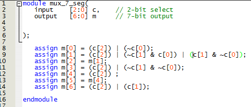

*Figure 4.3 — Main block Implementation*

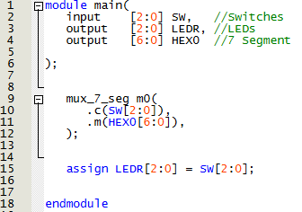

### Demonstration

*Figure 4.4 — 7-segment decoder Demonstration*

## PART V — 3-to-1 3-bits Multiplexer and 7-segment decoder to display word [HELLO] in 5 displays

### Objective
Implement and test a 3-to-1 3-bits multiplexer module with a 7 segments decoder to display the word "HELLO" using five displays.

### Logic / Design
A 3-to-1 3-bits multiplexer module handles a 7-segment decoder to display the word in five of the 7-segment displays. The 3-bit selector will switch the letters and create a cascade moviment.
To define the logic, a Look Up Table (LUT) is needed.

*Figure 5.1 — 3-to-1 3-bits multiplexer to 7-segment decoder LUT*

| Input (c2 c1 c0) | Character pattern [H4--H0] |
|------------------|----------------------------|
| 000              | H  E  L  L  O              |  
| 001              | E  L  L  O  H              |  
| 010              | L  L  O  H  E              |  
| 011              | L  O  H  E  L              |
| 100              | O  H  E  L  L              |

### Implementation
The implementation strated using the same logic as previous parts, but it was simpler using the conditional perspective.

*Figure 5.2 — 3-to-1 3-bits multiplexer Implementation*

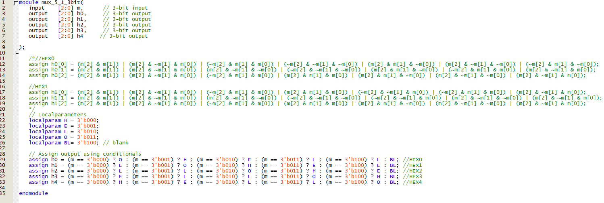

*Figure 5.3 — Main block Implementation*

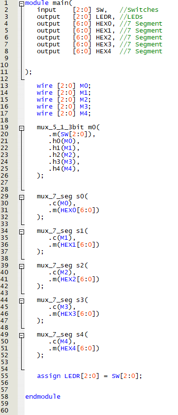

### Demonstration

*Figure 5.4 — 3-to-1 3-bits multiplexer to 7-segment decoder Demonstration*

## PART VI — 3-to-1 3-bits Multiplexer and 7-segment decoder to display word [HELLO] in six displays

### Objective
Implement and test a 3-to-1 3-bits multiplexer module with a 7 segments decoder to display the word "HELLO" using six displays.

### Logic / Design
A 3-to-1 3-bits multiplexer module handles a 7-segment decoder to display the word in six of the 7-segment displays. The 3-bit selector will switch the letters and create the ilusion of moviment.
To define the logic, a Look Up Table (LUT) is needed.

*Figure 6.1 — 3-to-1 3-bits multiplexer to 7-segment decoder LUT*

| Input (c2 c1 c0) | Character pattern [H5--H0] |
|------------------|----------------------------|
| 000              | /  H  E  L  L  O           |  
| 001              | E  L  L  O  H  /           |  
| 010              | L  L  O  H  /  E           |  
| 011              | L  O  H  /  E  L           |
| 100              | O  H  /  E  L  L           |
| 101              | O  /  H  E  L  L           |

### Implementation
Using the implementation of previous parts, the sixth display is included in the logic as the 'Blank' space.

*Figure 6.2 — 3-to-1 3-bits multiplexer Implementation*

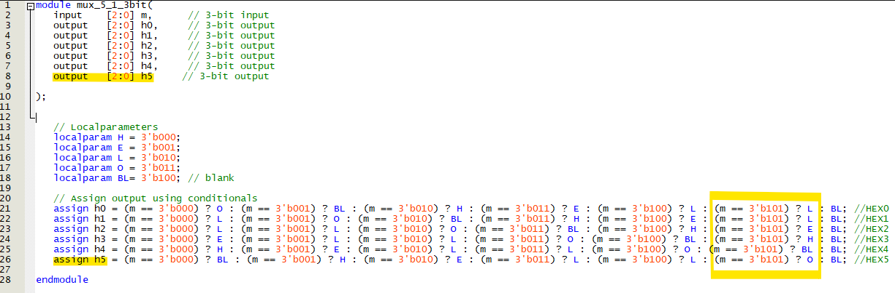

*Figure 6.3 — Main block Implementation*

### Demonstration

*Figure 6.4 — 3-to-1 3-bits multiplexer to 7-segment decoder Demonstration*

## (extra) PART VII — 3-to-1 3-bits Multiplexer and 7-segment decoder to display word [HELLO] in six displays with moviment

### Objective
Implement and test a 3-to-1 3-bits multiplexer module with a 7 segments decoder to display the word "HELLO" using six displays and moving the letters without selectors.

### Logic / Design
A 3-to-1 3-bits multiplexer module handles a 7-segment decoder to display the word in six of the 7-segment displays. The 3-bit selector is subtituded with an automated module with a 0 to 6 counter.

