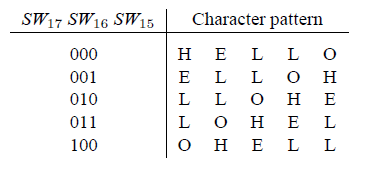
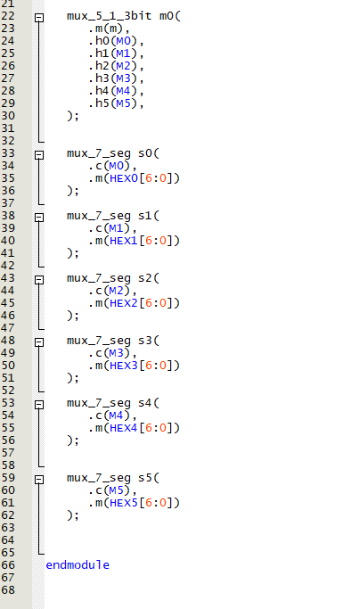

# Lab 1 — Switches, Lights, and Multiplexers (FPGA DE10-Lite)

This repository documents my first FPGA lab using the DE10-Lite (MAX 10 10M50DAF484C7G).  
The goal is to learn how to connect simple input/output devices and implement multiplexers, decoders, and sequential logic. I will use the switches SW9-0 as inputs to the circuit, light emitting diodes (LEDs) and 7-segment displays as output devices.

## Table of Contents
- [Part I — Switches to LEDs](## PART I)
- [Part II — 2-to-1 4-bit MUX](## PART I)
- [Part III — 4-to-1 2-bit MUX](#part-iii)
- [Part IV — 7-segment decoder (H, E, L, O)](#part-iv)
- [Part V — Static HELLO on 5 displays](#part-v)
- [Part VI — HELLO with blank space](#part-vi)
- [Part VII (Extra) — Automatic scrolling HELLO](#part-vii-extra)

  
## PART I -- Switches to LEDs

### Objective
Implement and test a simple assignament of the switches to the LEDs.

### Logic / Design
A main block contains the expression to assign the nine switches to the corresponding LEDs.

*Figure 1.1 — Switches to LEDs assignament logic*

### Implementation

*Figure 1.2 — Switches to LEDs Implementation*

## PART II -- 2-to-1 4-bit Multiplexer

### Objective
Implement and test a 2-to-1 multiplexer that handles 4-bit inputs using Verilog on the DE10-Lite FPGA.

### Logic / Design
A 4-bit multiplexer can be built by combining four instances of a 2-to-1 1-bit multiplexer.

*Figure 2.1 — 1-bit 2-to-1 multiplexer logic*

*Figure 2.2 — 4-bit 2-to-1 multiplexer block diagram*

### Implementation

*Figure 2.3 — 1-bit 2-to-1 multiplexer Implementation*

*Figure 2.4 — 4-bit 2-to-1 multiplexer Implementation*

*Figure 2.5 — Main block Implementation*

### Demonstration

## PART III
### Module with the funcitonality of a 4-to-1 2 bit multiplexer

Using Logisim Evolution we can simulated the functionality of both a 2-to-1 1bit and 2-to-1 8bit multimplexer to understant how it works.

As we only have ten selectors in our FPGA, we will implement a 4-to-1 2bit multimplexer. In it will be two 4-to-1 1bit multimplexers with the following logic:

And in our main file we will need to call the 4-to-1 2bit using the selector switches and the LEDs.

Bellow can be seen a demonstration:

## PART IV
### Module of a 7 segments decoder to print the letters "H", "E", "L" and "O"

Using Logisim Evolution we can simulated the functionality of a 7 segment decoder to understant how it works. In our case we will only use 7 bits, the "dot" (8th bit is not needed)

To define the logic, we would use the following Look Up Table (LUT). As our 7 segment displays are NOT active in high, whenever we want them to be off, we will set them as 1. After doing the Kmaps, we can implement the logic.
| Input (c2 c1 c0) | Output (HEX segments) | Letter |
|------------------|------------------------|--------|
| 000              | 0111111                | H      |
| 001              | 1001111                | E      |
| 010              | 1110110                | L      |
| 011              | 1111110                | O      |

And in our main file we will need to call 7 segment decoder using the selector switches and the LEDs.

Bellow can be seen a demonstration:

## PART V
### Multiplexer 3-to-1 3 bits to print an static "HELLO" in five 7-segments

After implementing the decoder in our previous part, we can use five of the 7-segments display to print the word "HELLO". And using the three selectors will switch the letters and create a cascade moviment.

At first I used the same procidure as our previous part, following the LUT and doing the kmaps but I straggled and decided to continue with a conditional prespective. In the following picture can be seen part of the logic I wrote commented.

And in our main file we will need to call five of our 7 segments decoder and the 5-to-1 3bit multimplexer using the selector switches and the LEDs.

Bellow can be seen a demonstration:

## PART VI
### Multiplexer 3-to-1 3 bits to print an static "HELLO" in six 7-segments

After implementing the decoder in our previous part, we can use the extra 7-segments display too to print the word "HELLO" and a space, creating a space at the end/begining to create the ilusion of moving with the three selectors.

We only need to insert the extra 7-segment display and modify the logic to implement the void before/after the word "HELLO".

And in our main file we will need to also include the extra 7 segments decoder and the 5-to-1 3bit multimplexer modified, using the selector switches and the LEDs.

Bellow can be seen a demonstration:

## (extra) PART VII 
### Implement a counter to trigger de segments without using the selector and make de word "HELLO" move by itself. Can be adjusted in time to go faster and slower.

